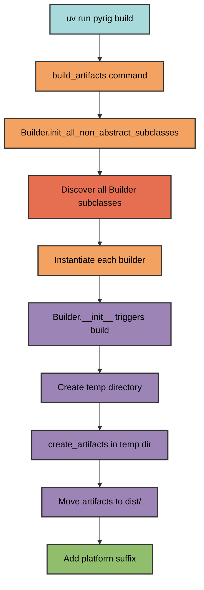
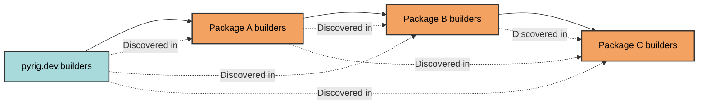

# Builder Architecture

pyrig's builder system uses automatic discovery to find and execute all Builder subclasses across packages, enabling extensible artifact creation.

## How It Works



## Builder Discovery

Builders are discovered through the dependency graph:



### Discovery Process

1. **Find all packages** depending on pyrig using dependency graph
2. **Locate builders modules** equivalent to `pyrig.dev.builders` in each package
3. **Find all Builder subclasses** in those modules
4. **Filter non-abstract classes** (discard parent classes, keep leaf implementations)
5. **Instantiate each builder** to trigger the build process

This means only the most specific (leaf) implementations are executed.
If you have non-abstract Builder in package A and then subclass that class in B then only the subclass in B will be executed. The same goes for ConfigFiles

## Builder Base Class

The `Builder` abstract base class provides the framework:

```python
from abc import ABC, abstractmethod
from pathlib import Path

class Builder(ABC):
    ARTIFACTS_DIR_NAME = "dist"
    
    @classmethod
    @abstractmethod
    def create_artifacts(cls, temp_artifacts_dir: Path) -> None:
        """Implement this to create your artifacts."""
        pass
    
    def __init__(self) -> None:
        """Instantiation triggers the build."""
        self.__class__.build()
```

### Key Methods

| Method | Purpose |
|--------|---------|
| `create_artifacts` | **Abstract** - Implement to define build logic |
| `build` | Orchestrates temp directory, artifact creation, and moving |
| `get_artifacts_dir` | Returns final output directory (default: `dist/`) |
| `rename_artifacts` | Adds platform suffix to artifacts |
| `get_non_abstract_subclasses` | Discovers all builders across packages |

## Build Process

### 1. Temporary Directory Creation

```python
with tempfile.TemporaryDirectory() as temp_build_dir:
    temp_artifacts_dir = cls.get_temp_artifacts_path(temp_dir_path)
```

Builds happen in isolated temporary directories to avoid polluting the workspace.

### 2. Artifact Creation

```python
cls.create_artifacts(temp_artifacts_dir)
```

Your implementation writes artifacts to the temporary directory.

### 3. Artifact Collection

```python
artifacts = cls.get_temp_artifacts(temp_artifacts_dir)
```

All files in the temp directory are collected as artifacts.

### 4. Platform-Specific Naming

```python
cls.rename_artifacts(artifacts)
```

Artifacts are moved to `dist/` with platform suffixes:
- `my-app-Linux` on Linux
- `my-app-Darwin` on macOS
- `my-app-Windows` on Windows

## Creating a Custom Builder

### Basic Example

```python
import shutil
from pathlib import Path
from pyrig.dev.builders.base.base import Builder

class DocumentationBuilder(Builder):
    @classmethod
    def create_artifacts(cls, temp_artifacts_dir: Path) -> None:
        """Build documentation as a zip file."""
        
        docs_dir = cls.get_root_path() / "docs"
        output_zip = temp_artifacts_dir / "docs"
        
        shutil.make_archive(str(output_zip), 'zip', docs_dir)
```

### File Location

Place builders in your package's builders module:

```
myapp/
└── dev/
    └── builders/
        ├── __init__.py
        └── documentation.py  # DocumentationBuilder defined here
```
You actually should not need one becuase pyrig will host your documentation for you on github pages via the workflows and builds them via mkdocs, but this is just an example of how subclassing the Builder base class work.

### Automatic Discovery

When you run `uv run myapp build`, pyrig:
1. Finds `myapp.dev.builders` module
2. Discovers `DocumentationBuilder` class
3. Instantiates it, triggering the build
4. Outputs `dist/docs-Linux.zip` (or platform-specific name)

## Multi-Package Example

```
pyrig (no concrete builders)
│
Package A (depends on pyrig)
├── builders/
│   └── executable.py  # PyInstallerBuilder subclass
│
Package B (depends on Package A)
├── builders/
    └── documentation.py  # Custom builder

Running `uv run pkgb build`:
✓ Discovers ExecutableBuilder from Package A
✓ Discovers DocumentationBuilder from Package B
✓ Builds both artifacts
✓ Outputs to dist/ with platform suffixes
```

## Helper Methods

The `Builder` class provides utilities for accessing project paths:

| Method | Returns |
|--------|---------|
| `get_app_name()` | Project name from pyproject.toml |
| `get_root_path()` | Project root directory |
| `get_main_path()` | Path to main.py entry point |
| `get_resources_path()` | Path to resources directory |
| `get_src_pkg_path()` | Path to source package |

These are particularly useful for PyInstaller builders and custom build processes.

If you do it right you should never even have to execute the command `uv run pyrig build` because the CI/CD pipeline will do it for you and upload the artifacts to github and add them to the release.

