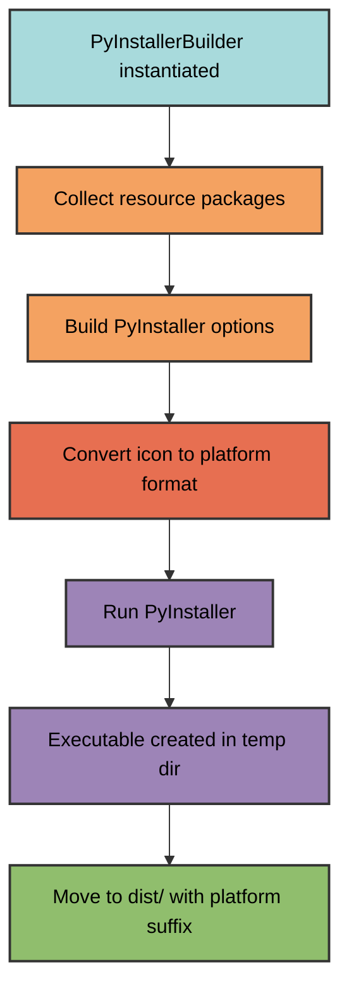
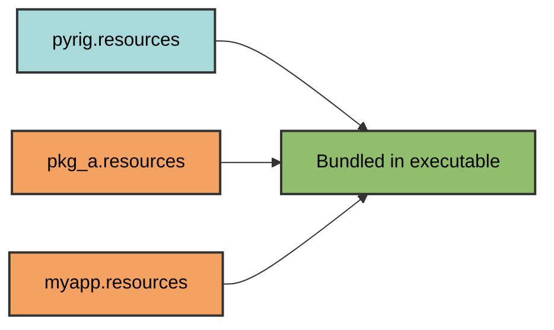

# PyInstaller Builder

pyrig provides `PyInstallerBuilder`, an abstract builder for creating standalone executables from Python projects using PyInstaller.

Note: The entire reasoin your main.py file is generated with a `if __name__ == "__main__":` guard is so that we could use it as an executable. becuase pyinstaller needs to execute that file and create a proper executable. And we also kept it becuase it is a python standard. However we prefer our CLI framework for running code.

## Overview

`PyInstallerBuilder` handles:
- **Executable creation** with PyInstaller
- **Resource bundling** from multiple packages
- **Icon conversion** to platform-specific formats
- **Platform-specific configuration** (Windows/macOS/Linux)
- **Automatic resource discovery** across dependency chain

## Quick Start

### 1. Create a Builder Subclass

```python
from types import ModuleType
from pyrig.dev.builders.pyinstaller import PyInstallerBuilder
import myapp.resources

class MyAppBuilder(PyInstallerBuilder):
    @classmethod
    def get_additional_resource_pkgs(cls) -> list[ModuleType]:
        """Specify packages containing resources to bundle."""
        return [myapp.resources]
```

A use case we had was that we needed to add the migrations folder for a database once as we had it not located in the resources directory, which is autoincluded by PyInstallerBuilder.

### 2. Add an Icon

Place `icon.png` in your resources directory:
```
myapp/
└── resources/
    └── icon.png  # 256x256 PNG recommended
```

Not you could also override `get_app_icon_png_path` to use a different icon at a custom location. I recommend keeping it in the resources directory though.

### 3. Build

```bash
uv run pyrig build
```

Output: `dist/myapp-Linux` (or `myapp-Darwin`, `myapp-Windows`)

## How It Works



## Resource Bundling

### Automatic Resource Discovery

Resources are automatically collected from:
1. **All packages depending on pyrig** - their `resources` modules
2. **Your additional packages** - specified in `get_additional_resource_pkgs`



### Resource Package Structure

```
myapp/
└── resources/
    ├── __init__.py
    ├── icon.png
    ├── config.json
    └── templates/
        └── default.html
```

All files in resource packages are bundled into the executable as additional data files via the same relative path using the pyinstaller method from its utils hooks:
```python
from PyInstaller.utils.hooks import collect_data_files

datas = collect_data_files('myapp.resources')
```

## Icon Management

### Icon Conversion

PyInstaller requires platform-specific icon formats:
- **Windows**: `.ico`
- **macOS**: `.icns`
- **Linux**: `.png`

`PyInstallerBuilder` automatically converts your `icon.png`:

```python
@classmethod
def get_app_icon_path(cls, temp_dir: Path) -> Path:
    if platform.system() == "Windows":
        return cls.convert_png_to_format("ico", temp_dir)
    if platform.system() == "Darwin":
        return cls.convert_png_to_format("icns", temp_dir)
    return cls.convert_png_to_format("png", temp_dir)
```

Note: Linux does not support icons, so pyinstaller just ignores the icon option on Linux.

### Custom Icon Location

Override `get_app_icon_png_path` to use a different icon:

```python
class MyAppBuilder(PyInstallerBuilder):
    @classmethod
    def get_additional_resource_pkgs(cls) -> list[ModuleType]:
        return [myapp.another_resources_pkg]
    
    @classmethod
    def get_app_icon_png_path(cls) -> Path:
        """Use custom icon location."""
        return cls.get_root_path() / "assets" / "custom-icon.png"
```

## PyInstaller Options

The builder generates these PyInstaller options:

| Option | Value | Purpose |
|--------|-------|---------|
| `--name` | Project name from pyproject.toml | Executable name |
| `--onefile` | Enabled | Single executable file |
| `--noconsole` | Enabled | No console window (GUI mode) |
| `--clean` | Enabled | Clean build cache |
| `--icon` | Platform-specific icon | Application icon |
| `--add-data` | All resource packages | Bundle resources |
| `--workpath` | Temp directory | Build artifacts location |
| `--specpath` | Temp directory | Spec file location |
| `--distpath` | Temp directory | Output location |

### Customizing Options

Override `get_pyinstaller_options` for full control:

```python
class MyAppBuilder(PyInstallerBuilder):
    @classmethod
    def get_additional_resource_pkgs(cls) -> list[ModuleType]:
        return [myapp.resources]
    
    @classmethod
    def get_pyinstaller_options(cls, temp_artifacts_dir: Path) -> list[str]:
        """Customize PyInstaller options."""
        options = super().get_pyinstaller_options(temp_artifacts_dir)
        
        # Remove --noconsole to show console
        options.remove("--noconsole")
        
        # Add hidden imports
        options.extend(["--hidden-import", "my_hidden_module"])
        
        return options
```

## Advanced Customization

### Multiple Resource Packages

```python
import myapp.resources
import myapp.templates
import myapp.data

class MyAppBuilder(PyInstallerBuilder):
    @classmethod
    def get_additional_resource_pkgs(cls) -> list[ModuleType]:
        return [
            myapp.resources,
            myapp.templates,
            myapp.data,
        ]
```

### Console Application

```python
class MyConsoleAppBuilder(PyInstallerBuilder):
    @classmethod
    def get_additional_resource_pkgs(cls) -> list[ModuleType]:
        return [myapp.resources]
    
    @classmethod
    def get_pyinstaller_options(cls, temp_artifacts_dir: Path) -> list[str]:
        options = super().get_pyinstaller_options(temp_artifacts_dir)
        options.remove("--noconsole")  # Show console window
        return options
```

### Custom Output Directory

```python
class MyAppBuilder(PyInstallerBuilder):
    ARTIFACTS_DIR_NAME = "build/executables"  # Custom output directory
    
    @classmethod
    def get_additional_resource_pkgs(cls) -> list[ModuleType]:
        return [myapp.resources]
```

## Multi-Package Example

```
pyrig (base package)
├── resources/
│   └── base-config.json
│
Package A (depends on pyrig)
├── resources/
│   └── pkg-a-data.json
│
My App (depends on Package A)
├── dev/
│   └── builders/
│       └── executable.py  # MyAppBuilder
└── resources/
    ├── icon.png
    └── app-config.json

Running `uv run pyrig build`:
✓ Discovers MyAppBuilder
✓ Bundles pyrig.resources (base-config.json)
✓ Bundles pkg_a.resources (pkg-a-data.json)
✓ Bundles myapp.resources (icon.png, app-config.json)
✓ Converts icon.png to platform format
✓ Creates executable: dist/myapp-Linux
```

## Requirements

PyInstaller builder requires these dependencies in your `pyproject.toml`:

```toml
[project.optional-dependencies]
dev = [
    "pyinstaller>=6.0.0",
    "pillow>=10.0.0",  # For icon conversion
]
```

These are included automatically when depending on pyrig via the standard dev dependency `pyrig-dev`.

