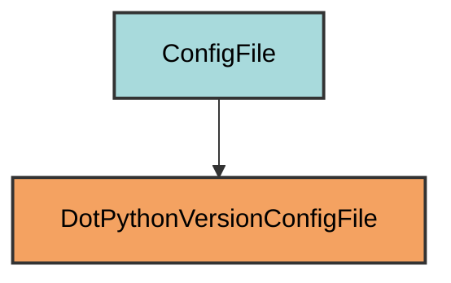

# .python-version Configuration

The `DotPythonVersionConfigFile` manages the `.python-version` file for Python version managers.

## Overview

Creates a .python-version file that:
- Specifies the Python version for the project
- Used by pyenv and similar version managers
- Automatically set to the first supported Python version from pyproject.toml
- Located at the project root
- Ensures consistent Python version across environments

## Inheritance



**Inherits from**: `ConfigFile`

**What this means**:
- Direct inheritance from ConfigFile
- Custom `load()` and `dump()` implementations
- Reads Python version from pyproject.toml
- Simple text file format

## File Location

**Path**: `.python-version` (project root)

**Extension**: `.python-version` - Version file.

**Filename**: Empty string to produce `.python-version`.

**Special filename handling**: 
- `get_filename()` returns `""`
- `get_file_extension()` returns `"python-version"`
- Combined: `.python-version`

## How It Works

### Automatic Generation

When initialized via `uv run myapp mkroot`, the file is created with:

1. **Version extraction**: Reads `requires-python` from pyproject.toml
2. **First version**: Uses the first supported Python version
3. **File creation**: Writes the version to `.python-version`

### Version Configuration

```python
@classmethod
def get_configs(cls) -> dict[str, Any]:
    """Get the expected Python version from pyproject.toml."""
    return {
        cls.VERSION_KEY: str(
            PyprojectConfigFile.get_first_supported_python_version()
        )
    }
```

Example: If `requires-python = ">=3.10"`, the file contains `3.10`.

### Loading and Dumping

```python
@classmethod
def load(cls) -> dict[str, Any]:
    """Load the Python version from the file."""
    return {cls.VERSION_KEY: cls.get_path().read_text(encoding="utf-8")}

@classmethod
def dump(cls, config: dict[str, Any] | list[Any]) -> None:
    """Write the Python version to the file."""
    if not isinstance(config, dict):
        raise TypeError(f"Cannot dump {config} to .python-version file.")
    cls.get_path().write_text(config[cls.VERSION_KEY], encoding="utf-8")
```

## Usage

### Automatic Creation

```bash
uv run myapp mkroot
```

### File Content

```
3.10
```

Just the version number, nothing else.

### Using with pyenv

```bash
# pyenv automatically uses .python-version
cd /path/to/project
python --version  # Uses version from .python-version
```

### Using with other tools

- **asdf**: Reads `.python-version`
- **mise**: Reads `.python-version`
- **rtx**: Reads `.python-version`

## Dynamic Configuration

The version is determined from `pyproject.toml`:

```toml
[project]
requires-python = ">=3.12"
```

Pyrig extracts the first supported version (`3.12`) and writes it to `.python-version`.

## Best Practices

1. **Keep in sync**: Ensure `.python-version` matches `requires-python` in pyproject.toml
2. **Commit the file**: Include `.python-version` in version control
3. **Use pyenv**: Install uv to manage Python versions
4. **Update when needed**: Change the version when updating `requires-python`

