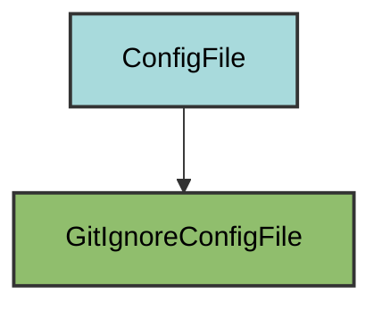

# GitIgnore Configuration

The `GitIgnoreConfigFile` manages the project's `.gitignore` file for excluding files from version control.

## Overview

Creates a comprehensive `.gitignore` file that:
- Fetches GitHub's standard Python.gitignore patterns
- Adds VS Code workspace files
- Includes pyrig-specific patterns
- Covers common cache directories
- Preserves user customizations while adding missing patterns

## Inheritance



**Inherits from**: `ConfigFile` (directly)

**What this means**:
- Custom implementation of `load()` and `dump()` methods
- Works with list of patterns instead of dict
- Validation checks if all required patterns exist
- Users can add custom patterns
- File is considered correct if it's a superset of required patterns

## File Location

**Path**: `.gitignore` (project root)

**Extension**: `.gitignore` - The filename is constructed specially to produce the dotfile name.

**Special filename handling**: `get_filename()` returns empty string so the path becomes `.gitignore` instead of `gitignore.gitignore`.

## How It Works

### Automatic Generation

When initialized via `uv run myapp mkroot`, the `.gitignore` file is created by:

1. **Fetching GitHub's Python.gitignore**: Downloads the latest standard Python patterns from GitHub. Falls back to bundled resource in pyrig's resources package if network fails.
2. **Adding pyrig-specific patterns**: Includes patterns for pyrig tools and workflows
3. **Merging with existing**: Preserves any patterns already in the file
4. **Avoiding duplicates**: Only adds patterns that don't already exist

### Pattern Sources

The `.gitignore` file combines patterns from multiple sources:

```python
[
    *cls.get_github_python_gitignore_as_list(),  # GitHub's standard Python patterns
    "# vscode stuff",
    ".vscode/",
    "",
    "# pyrig stuff",
    ".git/",
    ".experiment.py",
    "# others",
    ".env",
    ".coverage",
    "coverage.xml",
    ".mypy_cache/",
    ".pytest_cache/",
    ".ruff_cache/",
    ".venv/",
    "dist/",
    "site/",
]
```

### Validation Logic

The `get_configs()` method implements smart merging:

```python
existing = cls.load()  # Load current patterns
needed = [p for p in needed if p not in set(existing)]  # Filter out duplicates
return existing + needed  # Append only missing patterns
```

This ensures:
- User patterns are never removed
- Required patterns are always added
- No duplicate patterns
- Comments and organization are preserved

## Dynamic Configuration

The GitIgnore config adapts to your project automatically:

### GitHub Python Patterns

```python
@return_resource_content_on_fetch_error(resource_name="GITIGNORE")
def get_github_python_gitignore_as_str(cls) -> str:
    url = "https://raw.githubusercontent.com/github/gitignore/main/Python.gitignore"
    res = requests.get(url, timeout=10)
    res.raise_for_status()
    return res.text
```

**Fallback mechanism**: If the network request fails, uses a bundled resource file from `pyrig/resources/GITIGNORE`.

### Project-Specific Files

```python
DotExperimentConfigFile.get_path().as_posix()  # .experiment.py
DotEnvConfigFile.get_path().as_posix()  # .env
```

Automatically includes paths to other config files that should be ignored.

## Usage

### Automatic Updates

The `.gitignore` file is automatically updated when:
- Running `uv run myapp mkroot`
- New pyrig patterns are added in updates
- GitHub's Python.gitignore is updated (on next initialization)

### Adding Custom Patterns

Simply edit `.gitignore` and add your patterns:

```gitignore
# Your custom patterns
*.local
secrets/
temp_data/
```

These will be preserved when pyrig adds new required patterns.

### Checking if Path is Ignored

Use the `path_is_in_gitignore()` method to check if a path matches any pattern:

```python
from pyrig.dev.configs.git.gitignore import GitIgnoreConfigFile

# Check if a path is ignored
is_ignored = GitIgnoreConfigFile.path_is_in_gitignore("my_file.py")
is_ignored = GitIgnoreConfigFile.path_is_in_gitignore(".venv/")
```

This uses the `pathspec` library with `gitwildmatch` for accurate pattern matching.

## Included Patterns

### From GitHub's Python.gitignore

- `__pycache__/` - Python bytecode cache
- `*.py[cod]` - Compiled Python files
- `*.so` - C extensions
- `dist/`, `build/`, `*.egg-info/` - Distribution files
- `.pytest_cache/`, `.coverage` - Test artifacts
- `.venv/`, `venv/` - Virtual environments
- And many more standard Python patterns

### VS Code

- `.vscode/` - VS Code workspace settings

### Pyrig-Specific

- `.git/` - Git directory (redundant but explicit)
- `.experiment.py` - Experimental code file
- `.env` - Environment variables and secrets

### Tool Caches

- `.mypy_cache/` - MyPy type checker cache
- `.pytest_cache/` - Pytest cache
- `.ruff_cache/` - Ruff linter cache
- `.coverage`, `coverage.xml` - Coverage reports

### Build Artifacts

- `dist/` - Distribution packages (from `uv publish`)
- `site/` - MkDocs build output

## Best Practices

1. **Don't remove required patterns**: Keep pyrig's patterns in the file
2. **Add project-specific patterns**: Append your own patterns as needed
3. **Use comments**: Organize patterns with comments for clarity
4. **Test pattern matching**: Use `path_is_in_gitignore()` to verify patterns work
5. **Commit .gitignore**: Always version control your `.gitignore` file

## Advanced Features

### Network Failure Handling

If GitHub is unreachable, pyrig uses a bundled fallback:

```python
@return_resource_content_on_fetch_error(resource_name="GITIGNORE")
```

The bundled `pyrig/resources/GITIGNORE` file contains a recent copy of GitHub's Python.gitignore.

### Pattern Matching

The `path_is_in_gitignore()` method handles:
- Relative and absolute paths
- Directory vs file detection
- Proper trailing slash handling for directories
- Git wildcard matching semantics

```python
# Handles directories correctly
GitIgnoreConfigFile.path_is_in_gitignore(".venv")  # True
GitIgnoreConfigFile.path_is_in_gitignore(".venv/")  # True

# Handles files
GitIgnoreConfigFile.path_is_in_gitignore("test.pyc")  # True (matches *.pyc)
```

