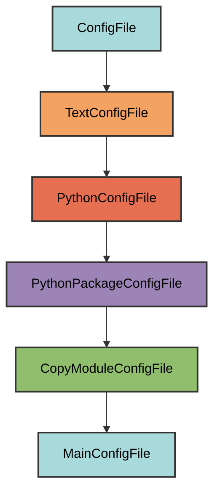

# main.py Configuration

The `MainConfigFile` manages the `main.py` file, which serves as the CLI entry point for your project.

## Overview

Creates a main.py file that:
- Serves as the CLI entry point for your application
- Copies the complete implementation from `pyrig.main`
- Provides a working CLI with subcommand support
- Automatically cleans up legacy root-level main.py files
- Allows customization while maintaining required structure
- Located in the `myapp/` directory (not project root)

## Inheritance



**Inherits from**: `CopyModuleConfigFile`

**What this means**:
- Python file format (`.py` extension)
- Copies entire module content from `pyrig.main`
- Automatically determines target path by replacing `pyrig` with your package name
- Ensures parent directory is a valid Python package
- Validation checks for required structure (`def main` and `if __name__ == "__main__":`)
- Users can modify the implementation while keeping required elements

## File Location

**Path**: `{package_name}/main.py` (e.g., `myapp/main.py`)

**Extension**: `.py` - Python source file.

**Filename**: `main` - Extracted from the source module name (`pyrig.main`).

**Path transformation**: `pyrig.main` → `{package_name}.src.main` → `{package_name}/src/main.py`

## How It Works

### Automatic Generation

When initialized via `uv run pyrig mkroot`, the `main.py` file is created with:

1. **Module copy**: Complete source code from `pyrig.main` is copied
2. **Path transformation**: Module path is transformed to match your package structure
3. **Package creation**: Parent directory becomes a valid Python package with `__init__.py`
4. **Legacy cleanup**: Any root-level `main.py` is deleted (uv creates one at initialization when doing uv init)

### Source Module

```python
@classmethod
def get_src_module(cls) -> ModuleType:
    """Get the source module to copy."""
    return main  # pyrig.main
```

The entire content of `pyrig/main.py` is copied to your project.

### Generated Content

The copied `main.py` includes an empty `main()` function:

```python
"""CLI entry point for the application."""

def main() -> None:
    """Main entry point for the CLI."""

if __name__ == "__main__":
    main()
```

### Legacy Cleanup

The `uv run pyrig init` method automatically cleans up old main.py files at root level:

```python
def __init__(self) -> None:
    """Initialize and clean up any root-level main.py."""
    super().__init__()
    self.__class__.delete_root_main()

@classmethod
def delete_root_main(cls) -> None:
    """Delete any root-level main.py file."""
    root_main_path = Path("main.py")
    if root_main_path.exists():
        root_main_path.unlink()
```

**Why this is needed**: uv creates a `main.py` at the project root. This cleanup ensures the file is only in `myapp/`.

## Dynamic Configuration

### Package Name

```python
PyprojectConfigFile.get_package_name()  # From pyproject.toml [project] name
```

The package name determines the target path:
- Project name: `my-app`
- Package name: `my_app`
- Target path: `my_app/main.py`

### Module Path Transformation

```python
src_module = cls.get_src_module()  # pyrig.main
new_module_name = get_module_name_replacing_start_module(
    src_module, PyprojectConfigFile.get_package_name()
)
# pyrig.main → myapp.main
```

This transformation ensures the file is placed in the correct location for your project.

## Validation Logic

The `is_correct()` method checks for required structure:

```python
@classmethod
def is_correct(cls) -> bool:
    """Check if the main.py file is valid."""
    return super().is_correct() or (
        "def main" in cls.get_file_content()
        and 'if __name__ == "__main__":' in cls.get_file_content()
    )
```

**Required elements**:
1. A `def main` function definition
2. The `if __name__ == "__main__":` guard

**Flexible implementation**: As long as these elements exist, you can customize the implementation.

## Usage

### Automatic Creation

The file is automatically created when you run:

```bash
uv run pyrig mkroot
```
Or via init or pyrigs autouse fixtures when running pytest:

```bash
uv run pyrig init
```

```bash
uv run pytest
```

### Running the CLI

Once created, you can run your CLI:

```bash
# Development mode
uv run myapp main
```

### Customizing main.py

You can modify the implementation while keeping required elements:

```python
"""CLI entry point for the application."""

def main() -> None:
    """Main entry point for the CLI."""
    print("Custom initialization")

if __name__ == "__main__":
    main()
```

As long as `def main` and `if __name__ == "__main__":` exist, validation passes.

## Best Practices

1. **Keep the structure**: Maintain `def main()` and `if __name__ == "__main__":`
4. **Keep it simple**: main.py should be a thin entry point, not business logic
5. **Don't move it**: Keep main.py in `myapp/`, not at project root

## CLI Architecture

The main.py file integrates with pyrig's CLI system:

```
main.py
  └─> CLI class (from pyrig.dev.cli.cli)
       ├─> Built-in commands (mkroot, build, etc.)
       ├─> Subcommands (from myapp/dev/cli/subcommands.py)
       └─> Shared subcommands (from myapp/dev/cli/shared_subcommands.py)
```

See the [CLI documentation](../cli/architecture.md) for details on adding custom commands.
